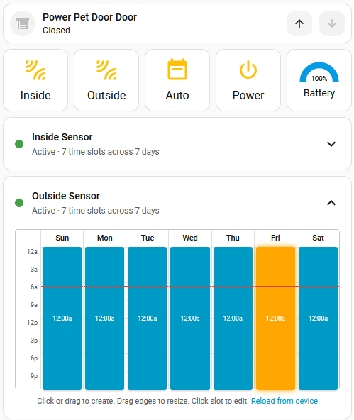

# Power Pet Door by High Tech Pet

[![Buy Me Coffee][buymecoffee]][donation]

[![Github Release][releases-shield]][releases]
[![Github Activity][commits-shield]][commits]
[![License][license-shield]][license]

[![hacs][hacsbadge]][hacs]
[![Project Maintenance][maintenance-shield]][user_profile]

Custom component to allow control and monitoring of the Power Pet Door made by High Tech Pet.

This addon was NOT made by anyone affiliated with High Tech Pet, don't bug them about it!

## Install

1. Ensure you have HACS installed.
2. Click into `Integrations`, then select the three dots `...` in the top-right corner, and select `Custom Repositories`
3. Paste the guthub respository URL (`https://github.com/corporategoth/ha-powerpetdoor`) into the Repository field, and select `Integration` as a category, then press `ADD`.

Once the custom repository is installed into HACS, you should be able to click the button below to install this integration.

[](https://my.home-assistant.io/redirect/hacs_repository/?owner=corporategoth&repository=ha-powerpetdoor&category=integration)

Alternatively, you can follow these steps:

1. Click into `Integrations` under HACS, then click the `+ EXPLORE & DOWNLOAD REPOSITORIES` button in the lower-right corner.
1. Search for `Power Pet Door`, and click it.
1. Click the `DOWNLOAD` button in the lower-right corner, then click `DOWNLOAD` in the dialog box that appears.

## Manual Installation

1. Copy the `powerpetdoor` directory from `custom_components` in this repository into the `custom_components` directory under your Home Assistant's configuration directory.
1. Restart your Home Assistant.

**NOTE**: Installing manually means you will also have to upgrade manually.

## Setup

Click on the button below to add the integration automatically.

[](https://my.home-assistant.io/redirect/config_flow_start/?domain=powerpetdoor)

Alternatively, you can follow these steps:

1. Install this integration.
1. Navigate to the Home Assistant Integrations (`Settings` -> `Devices & Services`).
1. Click the `+ ADD INTEGRATION` button in the lower right-hand corner.
1. Search for Power Pet Door, and select it.

## Configuration

You can go to the Integrations page and add a Power Pet Door integration.

| Option | Required | Default | Description |
| :--- | :---: | :--- | :--- |
| name | No | Power Pet Door | A pretty name for your Power Pet door entity |
| host | Yes |  | The host name or IP address of your Power Pet Door |
| port | No | 3000 | The port of your Power Pet Door |
| timeout | No | 10.0 | Time out on attempting to connect to your Power Pet Door (seconds) |
| reconnect | No | 5.0 | How long to wait between retrying to connect to your Power Pet Door if disconnected (seconds) |
| keep_alive | No | 30.0 | How often will we send a PING keep alive message to the Power Pet Door (seconds) |
| refresh | No | 300.0 | How often we pull the configuration settings from the Power Pet Door (seconds) |
| update | No |  | How often we update the current door position (seconds) |

## Entities

| Entity                         | Entity Type | Description                                                                                  |
|--------------------------------|-------------|----------------------------------------------------------------------------------------------|
| `Door`                         | `Cover`     | The main control for the door itself.  Acts like a shutter entity.                           |
| `Auto`                         | `Switch`    | Enable or disable the door sensors based on a schedule setup in the Power Pet Door app.      |
| `Battery`                      | `Sensor`    | Display the current charge of the battery, if one is attached.                               |
| `Cycle`                        | `Button`    | A button to perform the open / close cycle (or close the door if it's holding open).         |
| `Inside Sensor`                | `Switch`    | Enable or disable detection of a dog collar from the inside of the door.                     |
| `Outside Sensor`               | `Switch`    | Enable or disbale detection of a dog collar from the outside of the door.                    |
| `Power`                        | `Switch`    | Turn on or off the pet door (WiFi will stay enabled).  Disables ALL buttons, and door operation. |
| `Outside Safety Lock`          | `Switch`    | Always allow the pet to come inside, ignoring your schedule.                                 |
| `Pet Proximity Keep Open`      | `Switch`    | Keep the pet door open if the pet remains in proximity of the door.                          |
| `Auto Retract`                 | `Switch`    | Automatically retract (open) the door if it detects an obstruction while closing.            |
| `Latency`                      | `Sensor`    | The time it's taking for Home Assistant to communicate to the Power Pet Door (round trip).   |
| `Total Open Cycles`            | `Sensor`    | Total number of times the door has been opened.                                              |
| `Total Auto-Retracts`          | `Sensor`    | Total number of times the door re-opened itself due to a detected obsctuction.               |
| `Hold Time`                    | `Number`    | Amount of time (in seconds) to hold the door open during the open/close cycle.               |
| `Sensor Trigger Voltage`       | `Number`    | Voltage required to trigger the sensor to open the door (based on signal strength).          |
| `Sleep Sensor Trigger Voltage` | `Number`    | Voltage required to trigger the sensor to open the door (based on signal strength) while off. |
| `Notify Inside On`             | `Switch`    | Notify when your pet goes outside.                                                           |
| `Notify Inside Off`            | `Switch`    | Notify when your pet tries to go outside, but the Inside sensor is off.                      |
| `Notify Outside On`            | `Switch`    | Notify when your pet comes inside.                                                           |
| `Notify Outside Off`           | `Switch`    | Notify when your pet tries to come inside, but the Outside sensor is off.                    |
| `Notifyt Low Battery`          | `Switch`    | Notify when the door's battery is low.                                                       |


## Attributes

| Entity    | Attribute             | Type        | Description                                                                                                                                                                                                          |
|-----------|-----------------------|-------------|----------------------------------------------------------------------------------------------------------------------------------------------------------------------------------------------------------------------|
| `Door`    | `door_status`         | `string`    | The raw door status as reported by the door itself. This will be one of `DOOR_IDLE`, `DOOR_CLOSED`, `DOOR_HOLDING`, `DOOR_KEEPUP`, `DOOR_SLOWING`, `DOOR_CLOSING_TOP_OPEN`, `DOOR_RISING`, `DOOR_CLOSING_MID_OPEN`). |
| `Door`    | `current_position`    | `number`    | The position of the door (as a 'percentage open').  This will only ever show 0, 33, 66 or 100.                                                                                                                       |
| `Battery` | `battery_discharging` | `boolean`   | Whether the battery is draining (ie. the power is disconnected).                                                                                                                                                     |
| `Battery` | `battery_charging`    | `boolean`   | Whether the battery is charging (ie. power is connected).                                                                                                                                                            |
| `Latency` | `host`                | `string`    | The IP address (or host name) of the Power Pet Door.                                                                                                                                                                 |
| `Latency` | `port`                | `number`    | The TCP port of the Power Pet Door.                                                                                                                                                                                  |
| `Latency` | `hw_version`          | `string`    | The hardware revision of the Power Pet Door device.                                                                                                                                                                  |
| `Latency` | `sw_version`          | `string`    | The firmware revision installed on the Power Pet Door device.                                                                                                                                                        |
| `*`       | `last_change`         | `timestamp` | The last time the state changed.                                                                                                                                                                                     |
| `*`       | `device_class`        | `string`    | The device class the entity presents as.                                                                                                                                                                             |
| `*`       | `state_class`         | `string`    | The type of sensor this is (should always be `measurement`).                                                                                                                                                         |
| `*`       | `unit_of_measurement` | `string`    | The unit measured by this sensor.                                                                                                                                                                                    |

## Sample Card

Here is a sample lovelace card you could configure to control your Power Pet Door.



```
type: vertical-stack
cards:
  - type: custom:mushroom-cover-card
    entity: cover.power_pet_door_door
    show_position_control: false
    show_buttons_control: true
    fill_container: false
    layout: horizontal
    tap_action:
      action: call-service
      service: button.press
      target:
        entity_id: button.power_pet_door_button
      data: {}
  - type: horizontal-stack
    cards:
      - show_name: true
        show_icon: true
        type: button
        tap_action:
          action: toggle
        entity: switch.power_pet_door_inside_sensor
        name: Inside
      - show_name: true
        show_icon: true
        type: button
        tap_action:
          action: toggle
        entity: switch.power_pet_door_outside_sensor
        name: Outside
      - show_name: true
        show_icon: true
        type: button
        tap_action:
          action: toggle
        entity: switch.power_pet_door_auto
        name: Auto
      - show_name: true
        show_icon: true
        type: button
        tap_action:
          action: toggle
        entity: switch.power_pet_door_power
        name: Power
      - type: gauge
        entity: sensor.power_pet_door_battery
        name: Battery
        needle: false
```

## Credits

Big thanks to the authors of the [Envisalink component](https://home-assistant.io/integrations/envisalink), which I based a lot of the async networking code off of.

<!---->

***

[buymecoffee]: https://cdn.buymeacoffee.com/buttons/default-orange.png
[donation]: https://buymeacoffee.com/corporategoth
[commits-shield]: https://img.shields.io/github/commit-activity/y/corporategoth/ha-powerpetdoor.svg?style=for-the-badge
[commits]: https://github.com/corporategoth/ha-powerpetdoor/commits/main
[hacs]: https://hacs.xyz
[hacsbadge]: https://img.shields.io/badge/HACS-Custom-orange.svg?style=for-the-badge
[license]: https://github.com/corporategoth/ha-powerpetdoor/blob/main/LICENSE
[license-shield]: https://img.shields.io/github/license/corporategoth/ha-powerpetdoor.svg?style=for-the-badge
[maintenance-shield]: https://img.shields.io/badge/maintainer-%40corporategoth-blue.svg?style=for-the-badge
[releases-shield]: https://img.shields.io/github/release/corporategoth/ha-powerpetdoor.svg?style=for-the-badge
[releases]: https://github.com/corporategoth/ha-powerpetdoor/releases
[user_profile]: https://github.com/corporategoth