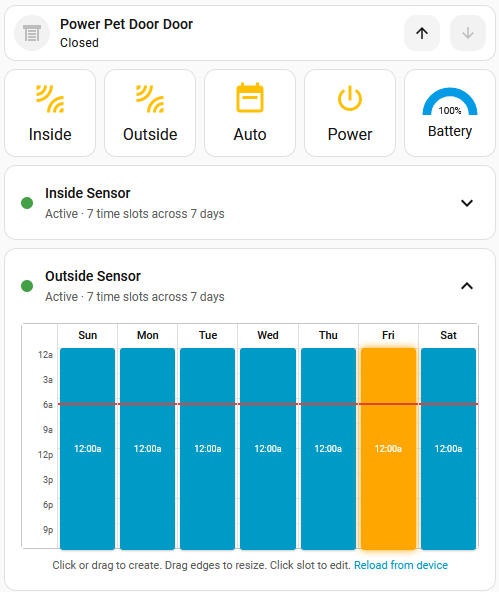

# Power Pet Door by High Tech Pet

[![Buy Me Coffee][buymecoffee]][donation]

[![Tests][tests-shield]][tests]
[![Github Release][releases-shield]][releases]
[![Github Activity][commits-shield]][commits]
[![License][license-shield]][license]

[![hacs][hacsbadge]][hacs]
[![Quality Scale][quality-shield]][quality]
[![Home Assistant][ha-shield]][ha-matrix]
[![Python Versions][python-shield]][ha-matrix]
[![Project Maintenance][maintenance-shield]][user_profile]

A [Home Assistant][homeassistant] integration for control and monitoring of the
[Power Pet Door][powerpetdoor] made by [High Tech Pet][hitecpet].

Talks to the door directly over your own network — no cloud, no account, no
polling. The door pushes changes as they happen.

  

## Disclaimer

**This integration is NOT authorized, endorsed, or supported by High Tech Pet
Products, Inc.**

This is an independent, community-developed project. No contributions,
financial or otherwise, have been received from High Tech Pet. Please don't
bug them about it — if you need official support for your door, contact
[High Tech Pet][hitecpet] directly.

## Install

This integration is in the **HACS default repository** — you no longer need to
add it as a custom repository.

1. Open **HACS** in Home Assistant.
2. Search for **Power Pet Door** and click **Download**.
3. Restart Home Assistant.
4. **Settings → Devices & services → Add integration**, search for
   **Power Pet Door**, and enter your door's IP address.

Full details, including manual installation and the Lovelace card, are in
**[docs/installation.md](docs/installation.md)**.

### Supported versions

The supported grid is **measured, not declared** — Home Assistant's stated
Python requirement is only a floor, and an old Home Assistant also pins old
dependencies that will not build on a new interpreter. So each interpreter has
both an oldest and a newest Home Assistant that actually works:

| Python | Oldest Home Assistant | Newest Home Assistant |
|--------|----------------------|-----------------------|
| 3.13   | 2025.4.0             | 2026.2.3              |
| 3.14   | 2025.11.0            | 2026.8.3              |

**Minimum Home Assistant: 2025.4.0.** Python 3.11 and 3.12 are not supported:
no Home Assistant that this integration passes its test suite against will run
on them.

That table is what the suite actually *passes* on, not what merely installs —
the difference is large. A resolve-only probe claimed support back to HA
2024.6.0 on Python 3.12; running the tests against each pair showed the
integration does not work there at all.

CI tests every pair in that table. It is regenerated by
`scripts/ha_matrix.py`, which probes the combinations for real — see
[docs/development.md](docs/development.md#supported-versions).

## What you get

One device with 29 entities. The headlines:

| Entity | What it does |
|---|---|
| `cover.<name>_door` | Open (and hold) or close the flap |
| `switch.<name>_power` | The door's motor power |
| `switch.<name>_inside_sensor` / `_outside_sensor` | Enable each pet sensor |
| `switch.<name>_connection` | Disconnect Home Assistant so the phone app can use the door |
| `binary_sensor.<name>_inside_schedule` / `_outside_schedule` | Whether a schedule window is open now |
| `sensor.<name>_battery` | Battery level |
| `button.<name>_cycle` / `_toggle` | One-shot commands the cover cannot express |

Plus configuration, diagnostic and statistics entities — several disabled by
default. The complete list, and what each one means, is in
**[docs/entities.md](docs/entities.md)**.

> **Note:** The Power Pet Door only supports a single network connection at a
> time. To use the official mobile app, turn the `Connection` switch off
> first. If Home Assistant cannot connect, make sure the mobile app is closed.

## Schedules

The door can enable each sensor on a weekly schedule. This integration ships a
Lovelace card for viewing and editing it by dragging:

Schedules can also be set from an automation with the
`powerpetdoor.set_schedule` action. See **[docs/schedules.md](docs/schedules.md)**.

## Documentation

| | |
|---|---|
| [Installation](docs/installation.md) | HACS, manual install, the Lovelace card, removal |
| [Entities](docs/entities.md) | Every entity, what it means, and which are disabled by default |
| [Schedules](docs/schedules.md) | The card, the `set_schedule` action, and how the door stores schedules |
| [Troubleshooting](docs/troubleshooting.md) | Connection problems, known limitations, diagnostics |
| [Development](docs/development.md) | Setup, tests, the supported-version matrix, releasing |
| [Changelog](CHANGELOG.md) | What changed, and when |

## How it works

All protocol handling lives in **[pypowerpetdoor][pypowerpetdoor]**, a
standalone library. This repository is the Home Assistant integration on top
of it — entities, the config flow, and the schedule card. To talk to a Power
Pet Door from something that is not Home Assistant, use the library directly;
it also ships a full door simulator.

## Credits

Big thanks to the authors of the
[Envisalink component](https://home-assistant.io/integrations/envisalink),
which a lot of the original async networking code was based on.

Licensed under the [MIT License](LICENSE).

<!---->

***

[buymecoffee]: https://cdn.buymeacoffee.com/buttons/default-orange.png
[donation]: https://buymeacoffee.com/corporategoth
[commits-shield]: https://img.shields.io/github/commit-activity/y/corporategoth/ha-powerpetdoor.svg?style=for-the-badge
[commits]: https://github.com/corporategoth/ha-powerpetdoor/commits/main
[hacs]: https://hacs.xyz
[hacsbadge]: https://img.shields.io/badge/HACS-Default-41BDF5.svg?style=for-the-badge
[license]: https://github.com/corporategoth/ha-powerpetdoor/blob/main/LICENSE
[license-shield]: https://img.shields.io/github/license/corporategoth/ha-powerpetdoor.svg?style=for-the-badge
[maintenance-shield]: https://img.shields.io/badge/maintainer-%40corporategoth-blue.svg?style=for-the-badge
[releases-shield]: https://img.shields.io/github/release/corporategoth/ha-powerpetdoor.svg?style=for-the-badge
[releases]: https://github.com/corporategoth/ha-powerpetdoor/releases
[tests-shield]: https://img.shields.io/github/actions/workflow/status/corporategoth/ha-powerpetdoor/test.yml?branch=main&label=tests&style=for-the-badge
[tests]: https://github.com/corporategoth/ha-powerpetdoor/actions/workflows/test.yml
[quality-shield]: https://img.shields.io/badge/quality%20scale-platinum-e5e4e2.svg?style=for-the-badge
[quality]: https://developers.home-assistant.io/docs/core/integration-quality-scale/
[ha-shield]: https://img.shields.io/badge/home%20assistant-2025.4.0%2B-41BDF5.svg?style=for-the-badge
[python-shield]: https://img.shields.io/badge/python-3.13%20%7C%203.14-blue.svg?style=for-the-badge
[ha-matrix]: https://github.com/corporategoth/ha-powerpetdoor/blob/main/docs/development.md#supported-versions
[user_profile]: https://github.com/corporategoth
[homeassistant]: https://www.home-assistant.io/
[hitecpet]: https://www.hitecpet.com/
[powerpetdoor]: https://www.hitecpet.com/collections/power-pet-doors3
[pypowerpetdoor]: https://github.com/corporategoth/py-powerpetdoor
